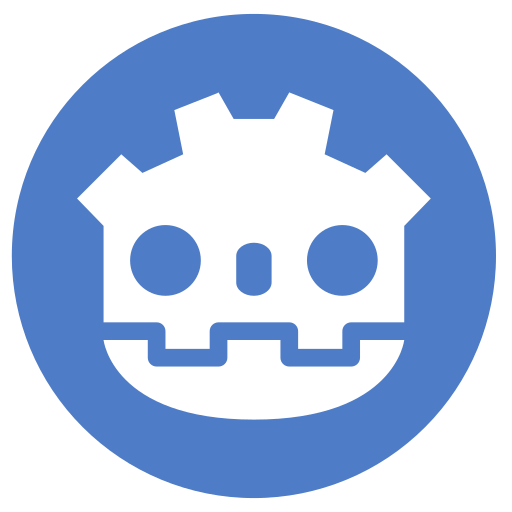

<!-- Apresentação -->
<h1 align="center">
     Igor da Silva Rafael
</h1>

  <strong>
     
    Game Developer
  </strong>

    Criando jogos...

---
<!--
<h1 align="left">
   Tech Stack
</h1>

  
  
  
  
  
  

---
-->
<!-- Meus projetos -->
<table align="center">
    <tr>
        <!-- Metroidvania -->
        <td width="300px" valign="top">
            

                <table width="100%" height="100%">
                    <tr> <!-- Parte superior do card -->
                        <td valign="top">
                            <!-- título do card -->
                            

                                    Metroidvania
                            

                            <!-- techs -->
                            

                                
                                
                            

                            <!-- breve descrição do projeto -->
                            
Game dev

                        </td>
                    </tr>
                    <tr> <!-- Parte inferior do card -->
                        <td valign="bottom">
                            <!-- link do projeto -->
                            <a href="https://github.com/IgorSRafael/Metroidvania.git">
                                 
                                Ver projeto
                            </a>
                        </td>
                    </tr>
                </table>
            

        </td>
        <!-- LabCoMU Game Web -->
        <td width="300px" valign="top">
            

                <table width="100%" height="100%">
                    <tr> <!-- Parte superior do card -->
                        <td valign="top">
                            <!-- título do card -->
                            

                                 
                                LabCoMU Game Web
                            

                            <!-- techs -->
                            

                                
                                
                                
                            

                            <!-- breve descrição do projeto -->
                            
Game dev

                        </td>
                    </tr>
                    <tr> <!-- Parte inferior do card -->
                        <td valign="bottom">
                            <!-- link do projeto -->
                            <a href="https://github.com/IgorSRafael/LabCoMU-game-web">
                                 
                                Ver projeto
                            </a>
                        </td>
                    </tr>
                </table>
            

        </td>
        <!-- Filtros em imagens PPM -->
        <td width="300px" valign="top">
            

                <table width="100%" height="100%">
                    <tr> <!-- Parte superior do card -->
                        <td valign="top">
                            <!-- título do card -->
                            

                                 
                                Filtros em imagens PPM
                            

                            <!-- techs -->
                            

                                
                            

                            <!-- breve descrição do projeto -->
                            
Processamento e manipulação de imagem PPM

                        </td>
                    </tr>
                    <tr> <!-- Parte inferior do card -->
                        <td valign="bottom">
                            <a href="https://github.com/IgorSRafael/Filtros-em-imagens-PPM">
                                 
                                Ver projeto
                            </a>
                        </td>
                    </tr>
                </table>
            

        </td>
    </tr>
</table>

---
<!-- Estatistica -->
